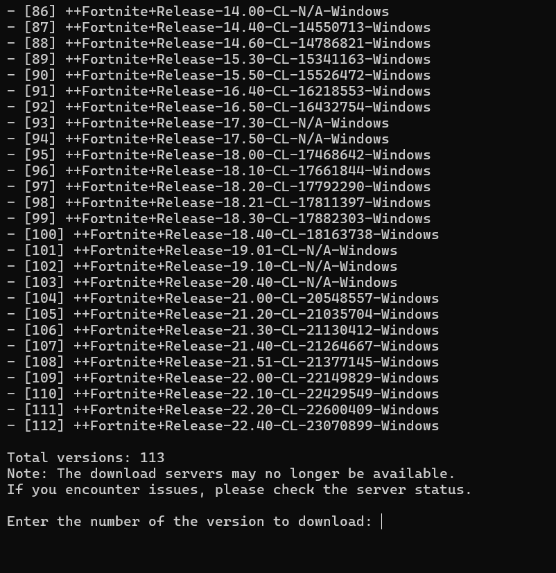

# LlamaDownloader
An app to download any Fortnite season without Manifest quickly and easily.

## Description

LlamaDownloader is a user-friendly application designed to simplify the process of downloading Fortnite seasons. Whether you're a content creator, a modder, or simply a fan looking to explore past seasons, this tool provides a convenient way to access and download the content you need.

This software is inspired by "EasyInstaller", but is not related to it. The difference is that no manifest.

## Features

* **Easy Season Selection**: Download any season from Chapter 1, 2, 3, 4 and 5 (32.11) with just a few clicks.
* **Fast Downloads**: Optimized for speed, ensuring you get your files quickly.
* **No Manifest Required**: Bypasses the need for complex manifest files, making the process straightforward.

## Installation

1.  Download the latest release of LlamaDownloader from the [Releases](https://github.com/Aorux01/LlamaDownloader/releases/tag/FortniteBuilds) page.
2.  Run the `LlamaDownloader.exe` file.
3.  Follow the on-screen instructions to select and download your desired Fortnite season.

## Usage

## Installer Tutorial

1.  **Launching the Installer:**
    * Double-click the `LlamaDownloader.exe` file you downloaded.
    * The LlamaDownloader installer will open.

2.  **Version Selection:**
    * A list of available Fortnite versions will be displayed, with a number to the left of each version.
    * Enter the number corresponding to the version you want to download.
    * Press Enter.

3.  **Installation Folder Selection:**
    * The installer will prompt you to choose the folder where you want to install the Fortnite season.
    * Enter the full path of the folder (e.g., `C:\FortniteSeasons`).
    * Press Enter.

4.  **Download Server Selection:**
    * A list of available download servers will be displayed.
    * Select the server from which you want to download the season.
    * Press Enter.

5.  **Download Start:**
    * The installer will begin downloading the Fortnite season from the selected server.
    * The download progress will be displayed on the screen.

6.  **Installation Completion:**
    * Once the download is complete, a confirmation message will be displayed.
    * You can now access the Fortnite season in the installation folder you chose.

## Contributing

Contributions are welcome! If you have any ideas, suggestions, or bug fixes, please feel free to submit a pull request or open an issue on the issues page.

## Screenshots

## Contact

If you have any questions, feedback, if you want to add a build or you have any problem with this, contact me on Discord with @aorux01
